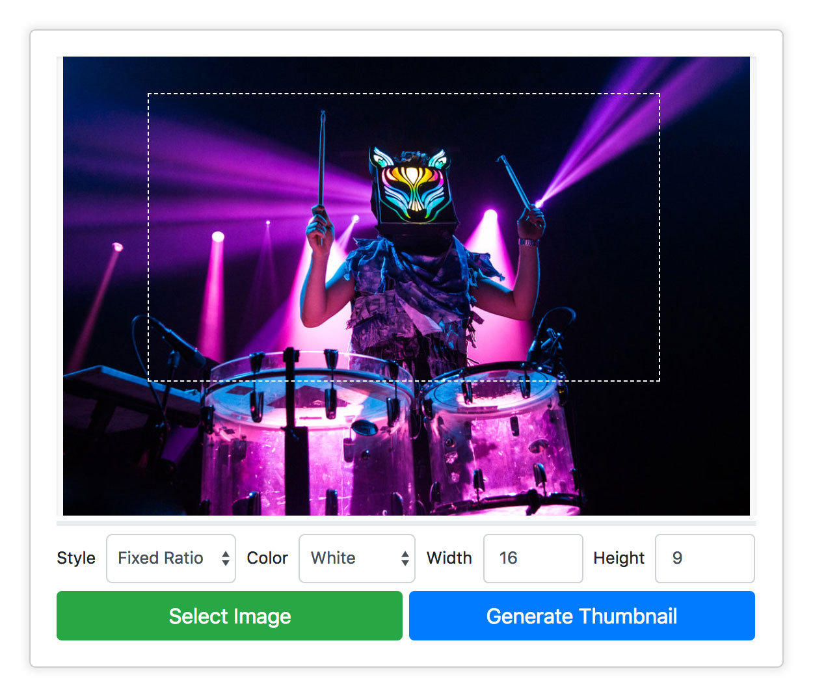

<p align="center">

</p>

<p align="center">
<b>A simple, browser based image cropping tool similar to the marquee tool in Photoshop.</b>
</p>

<p align="center">
<a href='https://image-crop.herokuapp.com/'></a>
</p>

## Live Demo

[It's running in a free Heroku sandbox and may take a moment to wake up.](https://image-crop.herokuapp.com/)

## Installation

Marquee is two parts: 1/ An NPM module that runs on the server which handles file uploads and image processing and 2/ A client side UI that runs in the browser.

Setting up the client side UI is as simple as copying and pasting the HTML below.

## Marquee UI

```html
<div id="marquee">
  <div class="viewer">
    
      <div class="cropper"></div>
    </div>
    <div class="progress">
      <div class="progress-bar progress-bar-striped active" role="progressbar" aria-valuenow="45" aria-valuemin="0" aria-valuemax="100"></div>
  </div>
  <div class="settings form-inline">
    <div class="form-group">
      <label class="ts">Style</label>
      <select class="form-control style">
        <option>Normal</option>
        <option>Fixed Ratio</option>
        <option>Fixed Size</option>
      </select>
      <label>Color</label>
      <select class="form-control color">
        <option>Black</option>
        <option selected>White</option>
        <option>Red</option>
        <option>Blue</option>
        <option>Yellow</option>
        <option>Gray</option>
        <option>Orange</option>
        <option>Green</option>
        <option>Purple</option>
      </select>
      <label>Width</label>
      <input class="w form-control" type="number" disabled>
      <label>Height</label>
      <input class="h form-control" type="number" disabled>
    </div>
  </div>
  <input class="file-dialog" type="file" accept=".png, .jpg, .jpeg, .gif" style="display: none">
  <button class="btn btn-success btn-select">Select Image</button>
  <button class="btn btn-primary btn-upload">Generate Thumbnail</button>
</div>
```

And including ``marquee.css`` & ``marquee.js`` at the top and bottom of the page.

```html
<html>
  <head>
    <link rel="stylesheet" href="/css/marquee.css">
  </head>
  <body>
  <!–– Marquee HTML -->
  <script src="https://code.jquery.com/jquery-3.3.1.min.js" integrity="sha256-FgpCb/KJQlLNfOu91ta32o/NMZxltwRo8QtmkMRdAu8=" crossorigin="anonymous"></script>
  <script src="/js/marquee.js"></script>
  </body>
</html>
```


The demo app uses [Twitter Bootstrap](https://getbootstrap.com/) to skin the UI. This is purely for aesthetic reasons and is not required for the demo to function. If you'd like to include it (recommended) add a link to it above ``marquee.css``.

```
<link rel="stylesheet" href="https://stackpath.bootstrapcdn.com/bootstrap/4.1.3/css/bootstrap.min.css">
<link rel="stylesheet" href="/css/marquee.css">
```

**Optional Download Modal**

At its core **Marquee** allows you to upload an image and define crop boundaries to generate a thumbnail of that image. The demo includes an optional download modal which displays the generated thumbnail and, you guessed it, allows you to download it. If you are using this module inside of a CMS chances are you don't need this functionality.

To include the download modal in your app add the following HTML.

```html
<div class="modal modal-download fade">
  <div class="modal-dialog">
    <div class="modal-content">
      <div class="modal-body">
        <div class="card"></div>
      </div>
      <div class="modal-footer"><a class="btn btn-danger" href="/" download>Download</a></div>
    </div>
  </div>
</div>
```

**Note:** The download modal <u>does</u> require [Twitter Bootstrap's Javascript library](https://maxcdn.bootstrapcdn.com/bootstrap/4.0.0/js/bootstrap.min.js). To include it just add the following links above ``marquee.js``

```html
<script src="https://code.jquery.com/jquery-3.3.1.min.js" integrity="sha256-FgpCb/KJQlLNfOu91ta32o/NMZxltwRo8QtmkMRdAu8=" crossorigin="anonymous"></script>
<script src="https://cdnjs.cloudflare.com/ajax/libs/popper.js/1.12.9/umd/popper.min.js" integrity="sha384-ApNbgh9B+Y1QKtv3Rn7W3mgPxhU9K/ScQsAP7hUibX39j7fakFPskvXusvfa0b4Q" crossorigin="anonymous"></script>
<script src="https://maxcdn.bootstrapcdn.com/bootstrap/4.0.0/js/bootstrap.min.js" integrity="sha384-JZR6Spejh4U02d8jOt6vLEHfe/JQGiRRSQQxSfFWpi1MquVdAyjUar5+76PVCmYl" crossorigin="anonymous"></script>
<script src="/js/marquee.js"></script>
```

**Pug Templates**

All of the aforementioned HTML is also included as [pug templates](https://pugjs.org/api/getting-started.html) if that's your thing.

* [index.pug](https://github.com/braitsch/marquee/blob/master/server/views/index.pug)
* [modal-download.pug](https://github.com/braitsch/marquee/blob/master/server/views/modal-download.pug)

## NPM Module & API

The second part to **Marquee** is the server side NPM module which you can install with:

``npm i --save @braitsch/marquee``

Once **Marquee** is installed you can include it in your server side application with:

``const marquee = require('@braitsch/marquee');``

### marquee.config
Takes an object with the following properties:

* ``uploads`` Path to the directory where you want to save your images. Path must be relative to the root of your application. Defaults to ``/server/uploads``
* ``keepFiles`` Whether or not to keep the original and cropped images on the server. If you are using Marquee inside of a CMS you'll probably want to set ``keepFiles`` to ``true``. The default setting in the demo is ``false``.

```Javascript
marquee.config({
	uploads : '/public/media', // <- relative to application root
	keepFiles : false // <- delete files after thumbnail is generated
});
```

### marquee.upload
Takes the incoming request object, parses the uploaded image file and crop data and generates the thumbnail. Saves both images to disk and returns a response object that describes the ``large`` (uploaded image) and ``small`` (generated thumbnail): 

* ``name:`` dynamically generated file name
* ``path:`` path to the image on your server
* ``base64:`` a base64 encoded string containing the image data

```Javascript
app.post('/upload', function(req, res, next){
	marquee.upload(req, function(response){
		res.send(JSON.stringify({
			name:response.small.name, base64:response.small.base64
		}));
	});
});
```

**Note:** The response is sent back to the client here so the cropped image can be displayed in the download modal.

### marquee.delete
Takes the incoming request object which contains the file name to delete and returns a boolean if the deletion was successful.

```Javascript
app.post('/delete', function(req, res){
	marquee.delete(req, function(deleted){
		res.sendStatus(200);
	});
});
```

### marquee.list
Lists the contents of the upload directory.

```Javascript
app.get('/list', function(req, res, next){
	marquee.list(function(files){
		res.send(files);
	});
});
```

### marquee.reset
Deletes everything in the upload directory.

```Javascript
app.get('/reset', function(req, res, next){
	marquee.reset(function(){
		res.redirect('/list');
	});
});
```

## Contributing

Feedback and pull requests are always welcome.